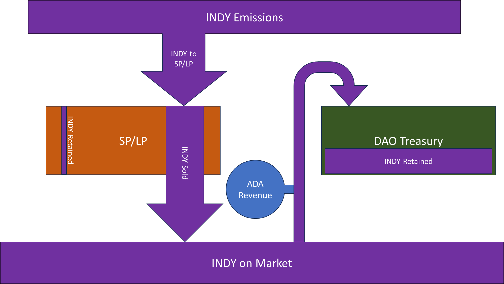
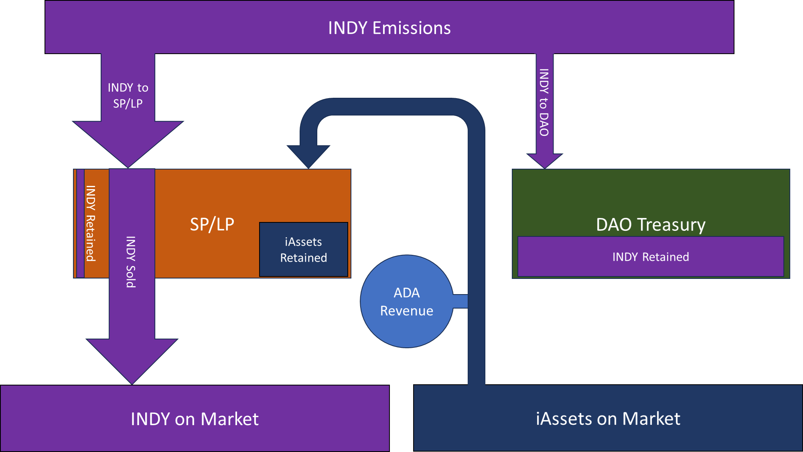

# Proposal to Enact an Indigo Peg Reserve

This purpose of this discussion is to examine the interest and feasibility of using CDP interest to fund an Indigo Peg Reserve (IPR). The IPR would be a reserve of funds that could be used to exchange on the market in a fashion that helps to maintain iAsset peg.

## Background
October 2024 marked a full year that Indigo's flagship asset, iUSD, has traded below peg on the open market. Indigo v2 brought some much needed improvements to the protocol and introduced interest rates for collateralized debt positions (CDPs) as opposed to the previous flat 2% fee when withdrawing collateral. Interest rates along with the redemption mechanisms enacted, however, have not been enough to maintain iAsset peg on the market for any substantial duration. One of the few on-chain proposals to fail was a relatively recent one to increase the redemption margin ratio (RMR). Many who opposed this proposal believe that the RMR should not be the sole tool for maintaining iAsset peg. This suggests that additional tools are needed to aid iAsset peg that are not as harsh as setting a high or unlimited RMR.

In July 2024 the DAO approved [Proposal #53: Phase One Treasury Management](https://app.indigoprotocol.io/governance/polls/53) to allocate revenue from CDP interest in a 40%/30%/30% split between operational expenditures (OPEX), INDY buybacks going to the treasury, and fee sharing for INDY stakers, respectively. This phase of treasury management has been successful at funding OPEX while providing additional incentives to hold INDY and adding buy pressure to the token. This management structure, however, currently does not allocate any funds toward directly addressing iAsset depegs. 

## The Indigo Peg Reserve
Perhaps the most obvious way to directly alleviate some of the short selling pressure in iAssets is to use some of the funds received as interest to buy iAssets off of the market when their rate is below the peg. This proposal suggests substituting the 30% of interest that currently is allocated for INDY buybacks and instead use this interest to fund an IPR. The IPR would be a pool of funds, similar to a Liquidity Pool, that users could exchange with. A portal to the pool would be hosted on the Indigo website where users could exchange iAssets for ADA near the current market rate or ADA for iAssets if the iAssets are above peg.

While the majority of funding would come from revenue from interest on CDPs, an IPR could partially fund itself by buying iAssets when the market rate is low and selling them back when the rate is high. The DAO would also have the option to use assets within the IPR for other functions...

## A Better Allocation of Funds
When examining the flow of INDY through the ecosystem, it becomes apparent that management of funds is currently sub-optimal (see Figure 1). On-chain analysis shows that roughly 90% (cite) of the INDY provided to stability pools (SP) ends up being sold shortly after on the market. The 30% of revenue going towards INDY buybacks then only partially counteracts the sell pressure of SP stakers. INDY stakers, on the other hand, tend to hold 80% of their INDY staking rewards. One way to interpret this is to say that stakers want to hold more of the asset that they are staking.

*Figure 1: Flow of INDY through the ecosystem under the current structure.*

A proposed adjustment is to enact an IPR and then use the iAssets that are received from exchanges with ADA (buybacks) in lieu of part of the INDY emissions that are provided to the SP as part of their staking reward historical return annualized (HRA). The overall HRA for the pools would not change as an equivalent value assets would still be provided. The SP would simply receive part of this value in the iAsset of the pool they are staking to and the remainding value in INDY (as the revenue allocated toward the IPR (buybacks) would not bt sufficient to completely replace the INDY incentives with an equivalent value of iAssets). Finally, the INDY emissions to the SP that were substituted for iAssets would then be rerouted to the DAO Treasury. In this manner, the DAO receives the same amount of INDY as if it were bought off of the market (slightly more as there is no slippage).

*Figure 2: Expected flow of INDY and iAssets through the ecosystem under the proposed structure.*

The net effect of the this proposal is intentionally subtle, as it largely mirrors the current allocation structure. The primary benefits are that it
* establishes an IPR, which guarantees a dedicated use of funds toward maintaining iAsset peg
* reduces sell pressure of INDY by SP stakers (less INDY received)
* increases buy pressure of iAssets that are below peg
* provides SP stakers with iAssets which they are more likely to keep.
* provides the DAO treasury with the same amount of INDY as if it were to perform INDY buybacks
* a better peg incentivizes more users to open CDPs (ex: short sellers/ADA longs) and thereby increases the DAO’s revenue stream via the interest they pay
* once peg is achieved, a reserve of ADA can begin to accrue to help absorb iAsset sell pressure and prevent the onset of future depegs

## Suggested IPR Parameters
* 30% of CDP interest goes toward funding an IPR
* 20% market cap limit on the treasury’s balance of any given iAsset (not an issue if iAssets are provided to the SP)
* IPR will continue to be funded at the proposed rate until a DAO vote is approved to change or suspend it

