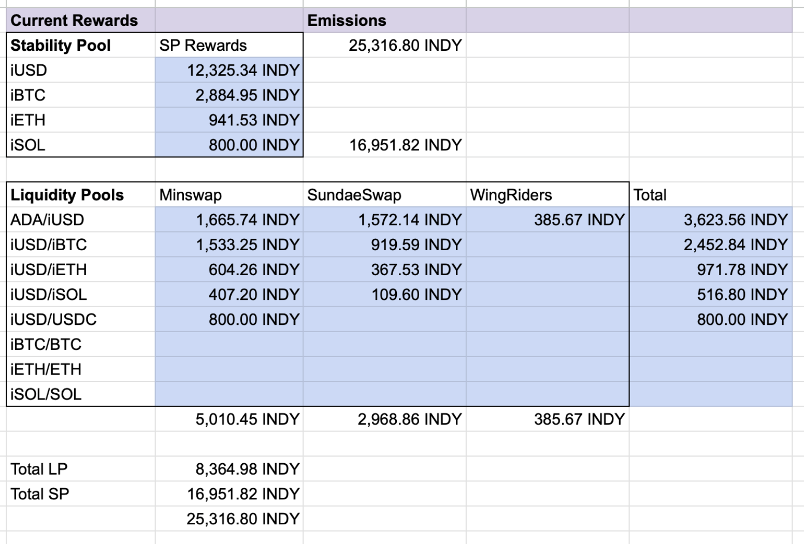
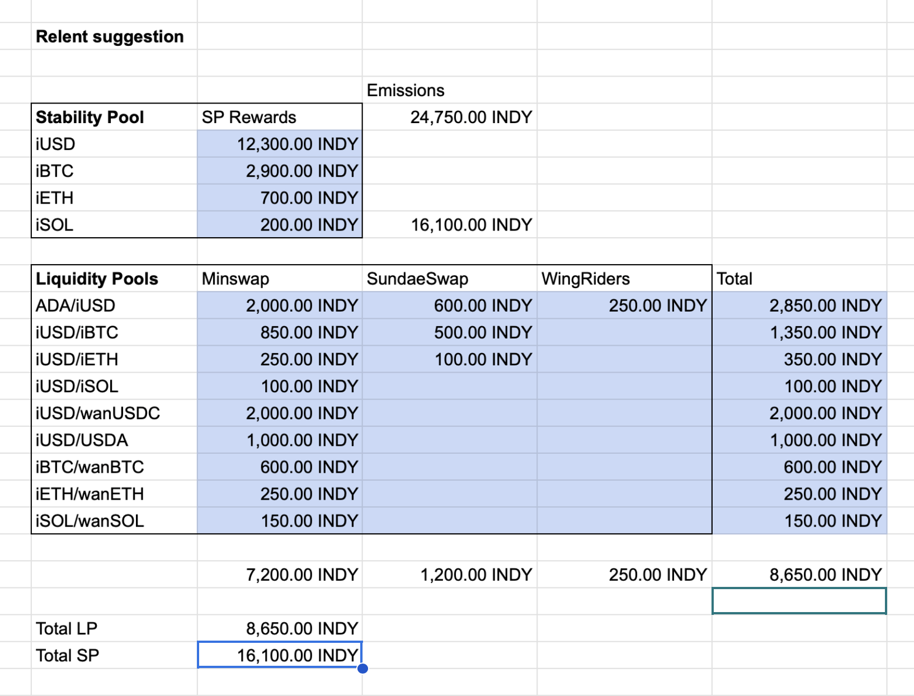

# Proposal to Enact a Dual Incentive Program with Wanchain

This proposal is for the reallocation of INDY emissions to partner with Wanchain in incentivizing 4 stableswap pools consisting of iAssets and their corresponding bridged asset on Cardano from the Wanchain bridge (USDC-iUSD, BTC-iBTC, ETH-iETH, and SOL-iSOL).

## Acronyms
CPMM - Constant Product Market Maker\
DAO - Decentralized Autonomous Organization\
DEX - Decentralized Exchange\
DIP - Dual Incentive Program\
PWG - Protocol Working Group

## Background
The Indigo PWG has piloted experimentally incentivizing an iUSD-USDC pool to help increase iUSD liquidity and provide an arbitrage loop to help stabilize the iUSD peg. The incentives have helped to attract up to 500k ADA in TVL to the pool which has provided up to 900k ADA/day in volume. Overall, we consider the pilot a success and wish to expand it to other iAsset pools. 
The PWG has reached out to Wanchain and together have made a agreement to both provide approximately $1600 in incentives per epoch over the course of 6 months to be distributed among 4 stableswap pools: USDC-iUSD, BTC-iBTC, ETH-iETH, and SOL-iSOL. The incentives for the Dual Incentive Program (DIP), on Indigo's end of the deal, will be provided in INDY while Wanchain will (at least initially) provide bridged USDC/USDT, BTC, and ETH as incentives. The agreement is contingent on both parties providing incentives and, as such, is subject to the Indigo DAO approving a redistribution of incentives towards these pools.

## Rewards Update
### Current Rewards
For the current rewards structure, we previously weighted the total incentives going towards any given iAsset by the relative USD value of the minted iAssets (which is now since outdated).

 

### Proposed Rewards
For the newly proposed rewards stucture, we've shifted some of the weightings to align more with the relative income that the iAsset generates from interest rather than strictly the minted TVL. This allows us to provide more incentives to those iAssets that have higher interest to more balance the risk/reward of minting higher interest iAssets. The overall effect is that iBTC, iETH, and iSOL receive fewer INDY incentives while iUSD receives more.

In addition to a reallocation between iAssets we are shifting a significant amount of rewards from standard CPMM pools to stableswap pools in order to meet our requirements for DIP.

Due to demand, we are also proposing incentivizing an iUSD-USDA stableswap as well for a trial period. These incentives may remain or can be reallocated during the next rewards update, depending on how well the pool performs.

Finally, as part of the long-term plan to reduce INDY emissions, we are also proposing a very modest cut to the overall rewards from the current 25,316.8 INDY / epoch to a flat 25,000 INDY / epoch. As an actual emissions cut will require a protocol upgrade, we simply propose sending the excess 316.8 INDY / epoch to the DAO Treasury.

